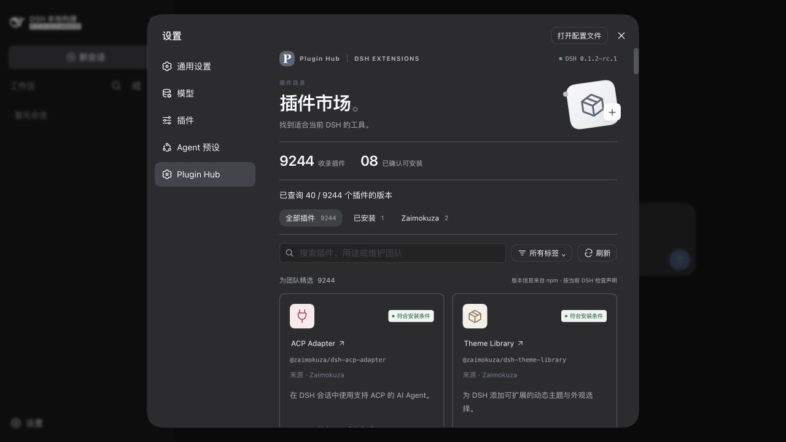
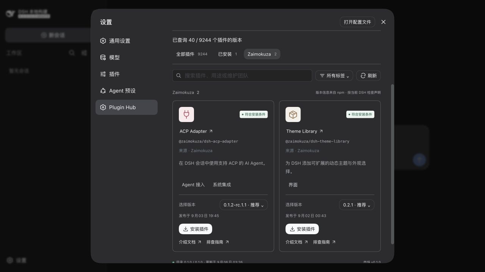
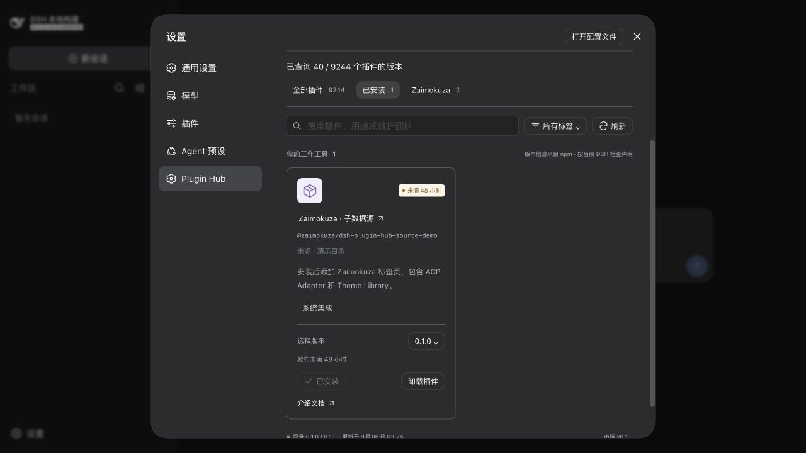
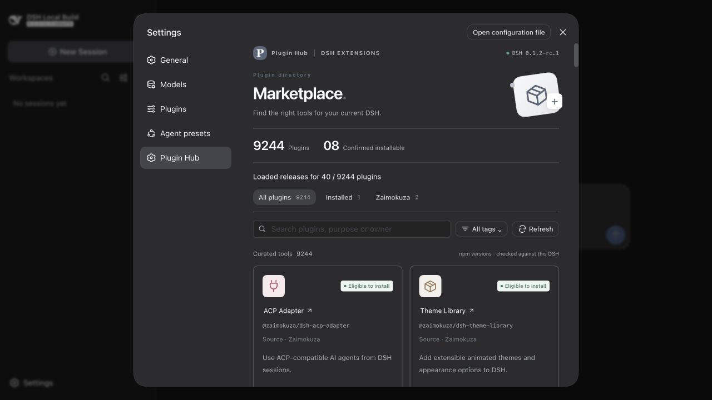

# DSH Plugin Hub

[English](#english)

**面向公司、部门和小团队的 DeepSeek Harness 插件市场底座。** 让各团队独立维护自己的插件目录，用同一套市场界面和扩展规范完成发现、版本筛选、安装与卸载。

## 解决什么问题

公司有通用插件，部门有业务插件，小团队也有只供内部使用的工具。把它们全部放进一个统一清单，会让列表越来越冗余，也让每次目录更新都依赖同一个维护者。

Plugin Hub 将市场与目录分开：

- **公司提供底座**：统一品牌、npm/Nexus 地址和公共目录，提供一致的使用入口。
- **部门和团队维护自己的来源**：通过子来源插件或公开 `registerSource` 接口接入，用户按需安装。每个来源有独立标签页，同名 npm 包去重，子来源优先。
- **目录独立更新**：既可使用 npm 数据包，也可由已有插件从自己的文件或接口提供 JSON；不必修改市场源码或把所有清单集中到同一个仓库。

私有目录与插件的访问权限由 Nexus 或提供方接口管理。来源标签页用于分类，**不是权限隔离机制**；接入后的目录会被当前 DSH 实例读取并缓存。需要不同用户之间隔离时，应结合独立实例和数据服务鉴权。

## 适配本机冷静期，快速定位版本

市场读取本机 pnpm 的 `minimumReleaseAge` 配置，与当前 DSH 的兼容声明一起筛选可安装版本。无有效配置时默认等待 **48 小时**；有效值 `0` 表示不等待。查询以 DSH 安装 profile 为工作目录，读取 pnpm 在该目录下生效的配置，单位为分钟。

页面展示实际冷静期及来源，并将相同分钟数传给安装命令。修改 pnpm 配置后重启 DSH 生效。实际下载仍受仓库策略和包管理器的依赖检查约束。[pnpm 配置说明](https://pnpm.io/cli/config)

## 用 CLI 快速构建

CLI 随 npm 包提供模板，**无需访问 GitHub 源码**，适合只能通过 Nexus 获取依赖的内网环境。

```sh
npx @zaimokuza/create-dsh-plugin-hub create-market team-market \
  --name @company/dsh-market --market-id team --title 'Team Tools' \
  --datasource npm:@company/dsh-catalog \
  --registry https://nexus.example/repository/npm-group/
cd team-market
npm install
npm run build
npm pack
```

生成的是可配置的真实 DSH 插件项目。也可使用 `create-source` 生成部门或团队来源；已有插件可以直接调用数据扩展接口，不依赖生成器。完整示例见[使用与目录规范](docs/guide.md)。内网使用时需确保相应包已同步到配置的仓库。

## 界面与演示

- DSH 原生组件，中英文界面；标题、副标题和主色可配置。
- 全部插件、已安装和来源标签页；支持批量安装后手动重启。
- 可选介绍文档、troubleshooting 链接；单个来源失败时保留有效缓存。

仓库附带的公共清单和 Zaimokuza 来源仅用于演示。企业生成项目读取自己配置的目录。





## 包结构

所有包使用 `@zaimokuza` scope。`-demo` 标明演示内容，安装操作仍是真实的。

| 包名（省略 scope） | 职责 |
| --- | --- |
| `dsh-plugin-hub` | 市场插件、可复用运行时与数据扩展接口 |
| `create-dsh-plugin-hub` | 企业市场与子来源生成器、构建器 |
| `dsh-plugin-hub-catalog-demo` | 公共目录 JSON 演示快照 |
| `dsh-plugin-hub-source-demo` | 为默认市场添加 Zaimokuza 标签页，本身也收录在主目录中 |
| `dsh-plugin-hub-source-catalog-demo` | ACP Adapter 与 Theme Library 的独立目录 |

## 安装与兼容性

```sh
dsh plugin --profile web add @zaimokuza/dsh-plugin-hub
# 可选，也可从市场中安装
dsh plugin --profile web add @zaimokuza/dsh-plugin-hub-source-demo
```

安装并手动重启 DSH，进入 **设置 → Plugin Hub**。要求 Node `^22.19.0 || >=24.0.0`；已实测 DSH `0.1.2-rc.1`。[npm 包](https://www.npmjs.com/package/@zaimokuza/dsh-plugin-hub)

市场自身与生成项目不按 DSH 版本号拦截，必要接口缺失时会报错。第三方插件仍按各自声明检查；“符合安装条件”不代表已经运行验证。第三方说明保留原文，目录可用 `locales` 提供翻译。

## 本地构建与测试

```sh
npm ci
npm run check
```

MIT；见[第三方声明](packages/marketplace/THIRD_PARTY_NOTICES.md)。

## English

**A DeepSeek Harness marketplace foundation for companies, departments and small teams.** Each team owns its catalog while sharing one interface and extension contract for discovery, version selection, installation and removal.

### Why this project exists

Company-wide tools, departmental integrations and private team plugins do not need to live in one ever-growing list maintained by one owner.

- **The company supplies the foundation:** shared branding, registry configuration and a common catalog.
- **Departments and teams own additional sources:** connect through source plugins or the public `registerSource` API. Users add the sources they need. Each source has a tab; duplicate npm names are merged with contributor entries taking precedence.
- **Catalogs change independently:** use npm data packages or let an existing plugin provide JSON from its own files or service. No marketplace source changes or central catalog repository are required.

Nexus or the data provider enforces access to private catalogs and packages. Source tabs organize content; **they are not access-control boundaries**. Connected catalogs are read and cached by the current DSH instance. Separate instances and authenticated data services are needed when users require isolation.

### Follow the local release-age policy

The market reads pnpm's `minimumReleaseAge` effective in the DSH installation profile and combines it with DSH compatibility declarations to find eligible versions. The fallback is **48 hours** when no valid configuration is available; an explicit `0` disables the wait. Values are minutes.

The UI shows the effective delay and its source, and the same minutes are passed to installation. Restart DSH after changing pnpm configuration. Registry policy and dependency checks still determine actual downloads. [pnpm configuration reference](https://pnpm.io/cli/config)

### Build quickly with the CLI

Templates ship in npm, so generating branded markets and source plugins **does not require GitHub access**. Use the CLI/build commands above; internal registries must have the corresponding packages available. `create-market` creates a real configurable DSH plugin; `create-source` creates a department/team source. Existing plugins may contribute lists directly without the generator. See the bilingual [guide](docs/guide.md).

### Interface and demo packages

Native DSH controls, Chinese/English UI, configurable branding, All/Installed/source tabs, optional documentation/troubleshooting links, and per-source caching. Install several plugins before restarting manually.

The five packages above separate runtime/API, CLI, main demo catalog, demo source plugin and its catalog. `-demo` identifies sample content; installation is real. Enterprise-generated markets read their configured catalogs.



### Installation and compatibility

Use the installation commands above, restart DSH and open **Settings → Plugin Hub**. Node `^22.19.0 || >=24.0.0` is required; DSH `0.1.2-rc.1` has been tested. The market and generated projects do not gate DSH by version; missing required APIs fail at runtime. Third-party declarations remain enforced. Eligibility is not runtime certification. Catalogs can translate author descriptions through `locales`. [npm package](https://www.npmjs.com/package/@zaimokuza/dsh-plugin-hub)

Run `npm ci` and `npm run check` to build and verify locally. MIT; see the [third-party notices](packages/marketplace/THIRD_PARTY_NOTICES.md).
